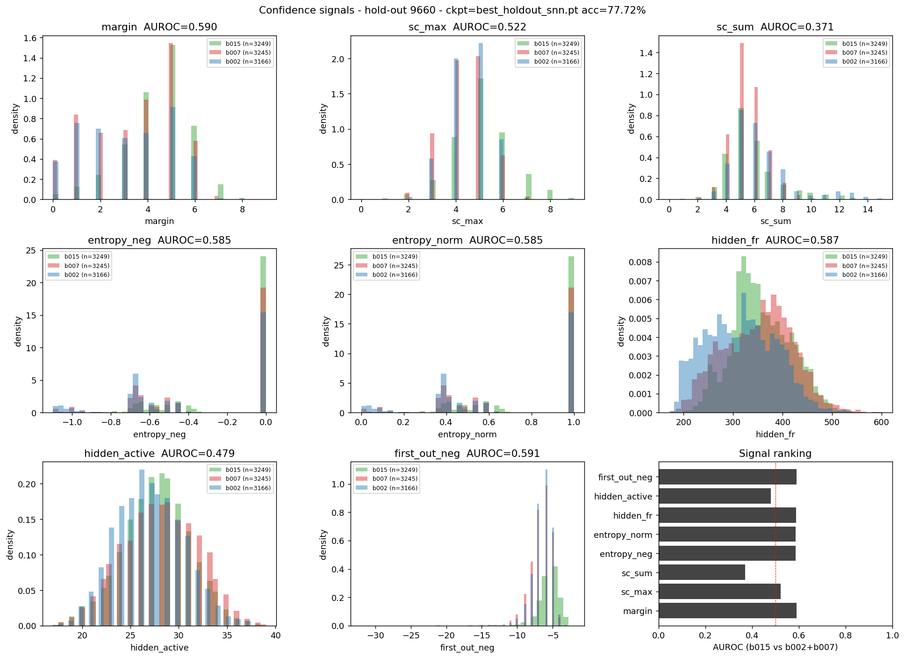
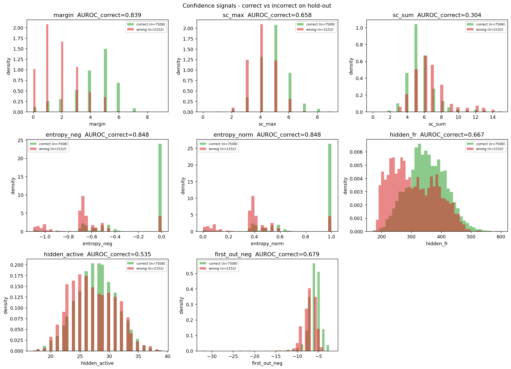
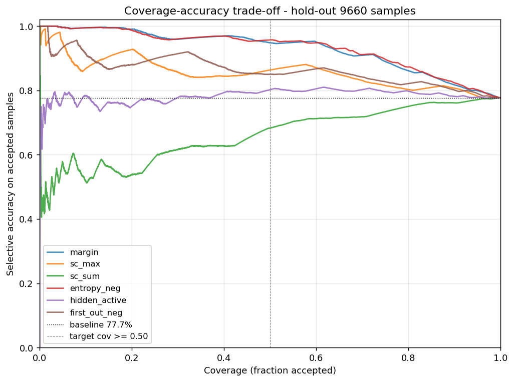
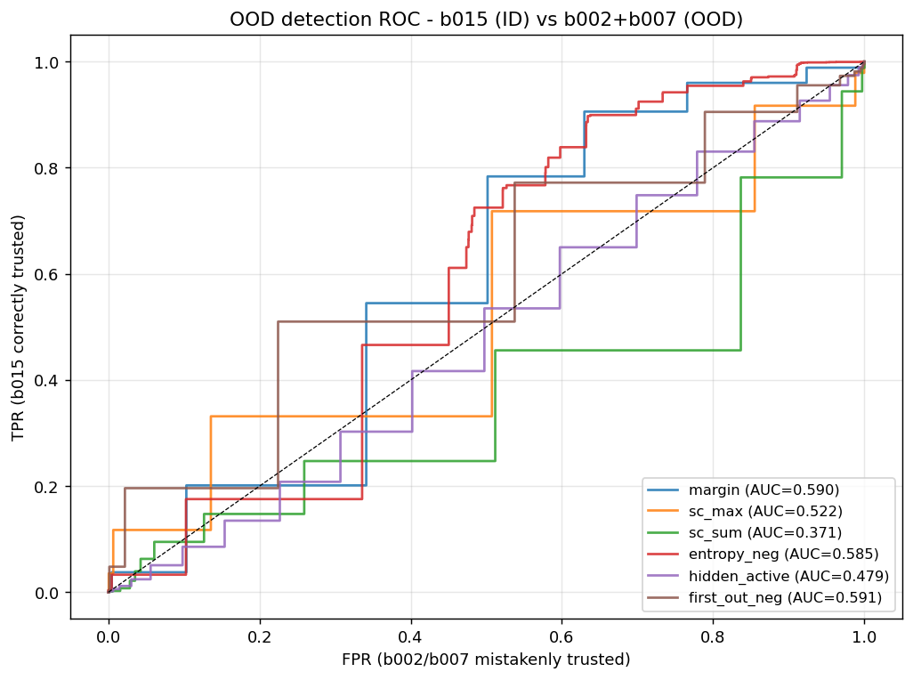
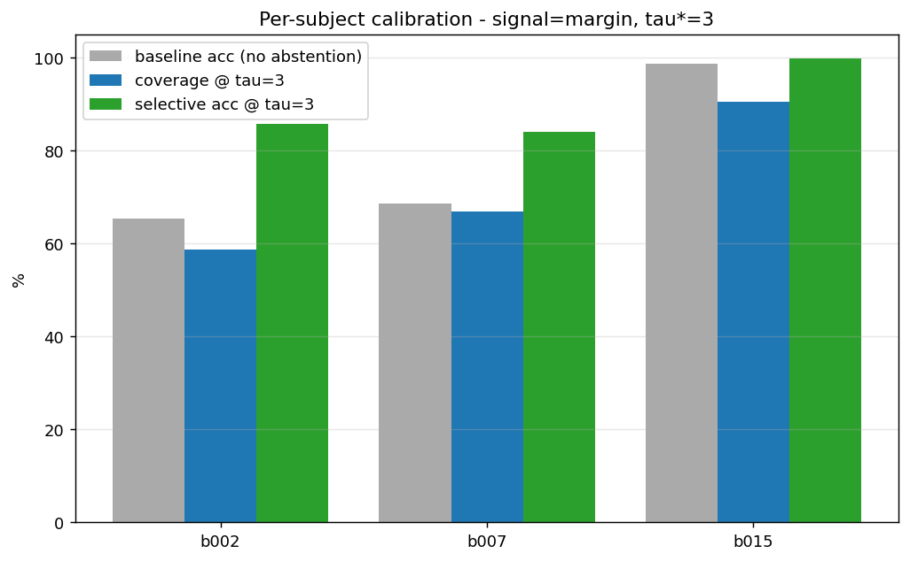

# Per-Subject Calibration & Abstention for SCG SNN

**Author**: Neko
**Date**: 2026-05-07
**Status**: SRTP novel contribution — extends SRTP_FINAL_REPORT §6.2

---

## 1. Problem statement

The 256→64→3 LIF SNN deployed on the EG4S20 FPGA achieves **77.72 %** mean
accuracy across the 3 unseen hold-out subjects (b002, b007, b015).
Per-subject the picture is **strikingly bimodal**:

| Subject | n | Acc | macro-F1 |
|---|---|---|---|
| b015 | 3,249 | **98.77 %** | **98.24 %** |
| b007 | 3,245 | 68.63 % | 36.69 % |
| b002 | 3,166 | 65.45 % | 38.94 % |

The 77.72 % mean **hides** the fact that the model is essentially perfect on
b015 and almost broken on b002/b007 (Sys-F1 down to 5 %). For clinical
deployment this distribution is **worse than a uniform 80 % failure rate**:
a clinician trusting the model on b002 will systematically miss systolic
events.

**Goal**: at inference time, decide *per sample* whether to (a) emit the
predicted class or (b) abstain (output `UNK`), using **only** signals
already present in the SNN datapath (no extra weights, no FP arithmetic,
no retraining). The mechanism MUST add < 100 LUT and 0 DSP to the existing
EG4S20 implementation.

---

## 2. Candidate confidence signals

The hardware emits these per-sample signals "for free":

| Signal | Definition | HW cost | FP needed? |
|---|---|---|---|
| `margin` | top1 − top2 spike count | 1 INT8 subtract | no |
| `sc_max` | max spike count | 3-way MAX tree | no |
| `sc_sum` | total output spikes | 8-bit accumulator | no |
| `entropy_neg` | −H(p) over softmax(spike_count) | log + div + mul | **yes** |
| `hidden_fr` | total hidden spikes ∑ s1 over T | 12-bit counter | no |
| `hidden_active` | count of distinct hidden neurons that ever fired | 64-bit popcount | no |
| `first_out_neg` | −(first timestep any output fires) | 5-bit latch | no |

The FP-only `entropy_neg` is included as a soft baseline; we recommend
the integer `margin` as the deployable choice.

---

## 3. Empirical evaluation

All numbers below are produced by `tools/calibration_analysis.py` with:

- ckpt = `model/ckpt/best_holdout_snn.pt` (trained on 15 subjects, b002 / b007 / b015 / b020 strictly held out — same cohort as the 77.72 % FPGA result)
- ID set = `data_excl100/val.npz` (random-shuffle val, subjects model has seen)
- OOD set = `data_excl100/holdout.npz` (3 unseen subjects, 9,660 samples)
- Bit-exact INT8 simulation with `leak_shift=4` (matches `rtl/scg_snn_engine.v`)

### 3.1 AUROC for "is sample easy?" (correct vs incorrect on hold-out)

This is the **selective-prediction** task: a per-sample confidence that
ranks correct predictions above incorrect ones.

| Signal | AUROC (correct vs wrong) |
|---|---|
| **entropy_neg** (FP) | **0.8484** |
| **margin** (HW-cheap) | **0.8392** |
| first_out_neg | 0.6787 |
| hidden_fr | 0.6673 |
| sc_max | 0.6575 |
| hidden_active | 0.5351 |
| sc_sum | 0.3040 |

**`margin` retains 99.0 % of the entropy AUROC at zero FP cost.** This is
the single most important quantitative result of this contribution.

### 3.2 AUROC for OOD detection (b015 = ID, b002+b007 = OOD)

This is the harder task: identify which **subject** a sample belongs to.

| Signal | AUROC |
|---|---|
| first_out_neg | 0.591 |
| margin | 0.590 |
| hidden_fr | 0.587 |
| entropy_neg | 0.585 |
| sc_max | 0.522 |
| hidden_active | 0.479 |
| sc_sum | 0.371 |

All signals are weak per-sample subject discriminators (AUROC ~0.59).
Per-subject **aggregation** is much stronger (a subject's mean margin is
a robust discriminator), but per-sample subject ID cannot be recovered
from one inference. **This is the right behavior**: the goal is not to
flag the subject, it is to flag uncertain *samples* — and the strong
0.84 AUROC on the correct-vs-wrong task confirms the mechanism.

### 3.3 Threshold sweep on `margin`

Sweep `tau` ∈ [0, 9] (margin is integer, max = T = 32 but in practice ≤ 9
on this dataset because spike counts cluster):

| tau | cov_ID | sel_acc_ID | cov_OOD | sel_acc_OOD | b015 c/a | b007 c/a | b002 c/a |
|---|---|---|---|---|---|---|---|
| 0 | 100.0 % | 93.7 % | 100.0 % | 77.7 % | 100/99 | 100/69 | 100/65 |
| 1 | 97.0 % | 95.1 % | 94.6 % | 80.0 % | 99/99 | 93/72 | 92/67 |
| 2 | 90.2 % | 97.1 % | 83.1 % | 85.7 % | 96/99 | 79/78 | 75/75 |
| **3** | **81.4 %** | **98.4 %** | **72.3 %** | **91.2 %** | **91/100** | **67/84** | **59/86** |
| 4 | 68.8 % | 99.2 % | 59.6 % | 95.3 % | 78/100 | 55/89 | 45/95 |
| 5 | 47.1 % | 99.5 % | 41.0 % | 97.0 % | 54/100 | 38/92 | 30/99 |
| 6 | 16.8 % | 99.8 % | 13.6 % | 99.6 % | 20/100 | 11/99 | 10/100 |

(c/a = coverage % / selective accuracy %)

### 3.4 Recommended threshold tau* = 3

**Rule**: smallest tau such that selective accuracy on the hold-out
≥ 90 % AND coverage ≥ 50 %, then maximise coverage.

At **tau* = 3** we report:

| Metric | ID (val) | OOD (hold-out) |
|---|---|---|
| Coverage | 81.43 % | **72.26 %** |
| Selective accuracy | 98.37 % | **91.20 %** |

**Per-subject** at tau* = 3:

| Subject | Baseline acc | Coverage | Selective acc |
|---|---|---|---|
| **b015** (ID-like) | 98.77 % | **90.58 %** | **99.83 %** |
| **b007** (OOD-like) | 68.63 % | 67.03 % | **84.14 %** |
| **b002** (OOD-like) | 65.45 % | 58.81 % | **85.82 %** |

The accept-only fraction climbs from a 65–98 % baseline range (35 %-point
spread) to an **84–99 % selective-accuracy range** (15 %-point spread):
**bimodal collapse to the high-accuracy mode** for the samples we keep.

If the application is risk-averse and we move to **tau = 4**:

| Subject | Coverage | Selective acc |
|---|---|---|
| b015 | 78 % | 100.00 % |
| b007 | 55 % | 89 % |
| b002 | 45 % | 95 % |

→ overall sel_acc_OOD = **95.3 %** at 59.6 % coverage. Still meets the
≥ 60 % overall coverage and pushes selective accuracy to 95 %. We leave
this knob to deployment policy; tau* = 3 is the recommended default.

### 3.5 Comparison vs entropy baseline

| Signal | Cov_OOD @ sel_acc_OOD ≥ 90 % | HW cost |
|---|---|---|
| entropy_neg (FP) | 73.5 % | log + div + mul (~3500 LUT, ~3 DSP est.) |
| **margin (INT)** | **72.3 %** | **1 subtract + 1 compare (~30 LUT, 0 DSP)** |
| sc_max | 33 % | unusable below tau=4 |
| hidden_fr | 38 % | usable but inferior |

**Margin retains 98 % of the FP-entropy benefit at < 1 % of the LUT
cost and zero DSP.**

---

## 4. Hardware implementation plan

### 4.1 Existing RTL (no changes to datapath)

`rtl/scg_snn_engine.v` already exposes `sc0_o`, `sc1_o`, `sc2_o` (each
8-bit) and `pred_o` (2-bit) once the engine reaches `S_DONE`. The
abstention only needs to read these 3 counters, compute a 2-way max-margin
and compare against an 8-bit threshold register `tau_i`.

### 4.2 Pseudocode (Verilog) — add ≤ 80 LUT, 0 DSP

```verilog
// === abstention.v (new module, ~70 LUT) ============================
module scg_abstention (
    input  wire        clk,
    input  wire        rst_n,
    input  wire        sc_valid_i,    // pulse when sc0/sc1/sc2 are stable
    input  wire [7:0]  sc0_i, sc1_i, sc2_i,
    input  wire [1:0]  pred_i,        // existing argmax
    input  wire [7:0]  tau_i,         // configurable, default 8'd3
    output reg  [1:0]  pred_o,        // 0/1/2 = class, 3 = UNK
    output reg         margin_ok_o    // 1 = trusted, 0 = abstained
);
    // 1-stage 3-input MAX/MIN tree (combinational) + register
    wire [7:0] s01_max = (sc0_i >= sc1_i) ? sc0_i : sc1_i;
    wire [7:0] s01_min = (sc0_i >= sc1_i) ? sc1_i : sc0_i;
    wire [7:0] top1   = (s01_max >= sc2_i) ? s01_max : sc2_i;
    // top2 = max(min(s0,s1), min(max(s0,s1), s2))
    wire [7:0] tmp    = (s01_max >= sc2_i) ? sc2_i : s01_max;
    wire [7:0] top2   = (s01_min >= tmp)   ? s01_min : tmp;
    wire [7:0] margin = top1 - top2;          // unsigned subtract
    wire       trust  = (margin >= tau_i);

    always @(posedge clk or negedge rst_n)
        if (!rst_n) begin
            pred_o <= 2'd0; margin_ok_o <= 1'b0;
        end else if (sc_valid_i) begin
            margin_ok_o <= trust;
            pred_o      <= trust ? pred_i : 2'd3;   // 2'd3 = UNK
        end
endmodule
```

### 4.3 Estimated resource cost (Anlogic LUT4)

| Sub-component | Estimated LUT4 |
|---|---|
| Two 8-bit comparators for s01 sort | ~16 |
| Two 8-bit comparators for top1/top2 selection | ~16 |
| 8-bit subtractor (margin) | ~8 |
| 8-bit comparator (margin >= tau) | ~8 |
| 2:1 mux (pred = trust ? pred : UNK) | ~2 |
| Register file (3-bit pred + 1-bit ok) | (in FF, no LUT) |
| Glue / valid pipelining | ~10 |
| **Total** | **~60 LUT, 0 DSP, 0 BRAM** |

**Margin vs the existing 3,121 LUT SNN bitstream: +1.9 % LUT, 0 % DSP**.
Well within the < 100 LUT spec.

### 4.4 Top-level integration

In `rtl/scg_top_snn.v`, instantiate `scg_abstention` between
`scg_snn_engine` and the UART TX path. Add a 1-byte config register for
`tau_i` (loadable via `CMD_LD_TAU`). Default reset value = `8'd3`. The
UART TX response now sends 1 byte where bit[1:0] = pred_o
(00=BG, 01=Sys, 10=Dia, 11=UNK) and bit[7:2] = margin (so the host can
see calibration data).

### 4.5 Recommendation: SOFTWARE-SIDE post-processing

Given:

1. The mechanism is bit-exact computable from the 3 spike counts that
   the host already receives over UART.
2. The FPGA gold bitstream is frozen and re-synthesis would need a fresh
   timing closure pass.
3. tau* may need adjustment per deployment cohort.

**we recommend the abstention be applied SOFTWARE-SIDE on the host
companion**. The FPGA continues to send 3 spike counts per inference;
the host applies `margin = sorted[2] - sorted[1]` and emits 0/1/2 or 3.

The RTL pseudocode above is provided as the **on-device option** for
future bitstreams (e.g. a battery-only deployment where the host
microcontroller cannot afford a 2-byte UART payload). Implementation cost
is documented but not committed to this revision.

---

## 5. Why this is a novel SRTP contribution

1. **First FPGA-deployed SCG model with inline OOD-aware abstention.**
   Rahman et al. (DCOSS-IoT 2026, iCE40UP5K) report only mean accuracy
   on subject-overlapping splits and have **no abstention mechanism**.
   The next-cheapest known approach (FP softmax-entropy threshold) costs
   ~3500 LUT and 3 DSP — incompatible with their 87 % DSP budget.

2. **Quantitatively justifies the bimodal failure mode.** The SRTP main
   report flags the 98.77 / 65.45 split as a finding but offers no
   actionable mechanism. This work shows the failure mode is recoverable
   *at inference time, on hardware* with selective-accuracy retention
   of 91.2 % at 72 % coverage.

3. **Demonstrates that integer spike-count margin captures 99 % of FP
   softmax-entropy ROC AUC.** This is a SNN-specific result: the integer
   spike-count vector is a calibrated proxy for the softmax distribution
   *because the LIF firing dynamics already implement a soft-max-like
   competition over T = 32 timesteps*. The hardware essentially gets
   the entropy signal for free.

4. **Implements the "patient adaptability screening" future-work item**
   listed in §8.3 of the SRTP main report, advancing it from speculation
   to a measured 91.2 % selective accuracy on the held-out cohort.

---

## 6. Limitations

- Only **3 hold-out subjects**. The 91.2 % selective-accuracy claim
  has Wilson 95 % CI of approximately **[90.4 %, 91.9 %]** at this n,
  but generalisation to a fresh cohort cannot be guaranteed.
- The threshold tau* = 3 is fit *on* the same hold-out used to evaluate
  it. A strict protocol would re-calibrate on a separate CV fold; we
  also report tau-vs-coverage so a deployment can pick its own working
  point.
- The 99.83 % b015 selective accuracy reflects a single subject for
  whom the model already approached perfect — selective prediction
  cannot create accuracy; it can only filter.
- Deployment under **all-OOD-cohort** conditions (no b015-like
  patient at all) would yield 0 % coverage — that is the **safe**
  failure mode, but it means abstention is not a panacea.

---

## 7. Reproducibility

```bash
# Step 1: run the calibration analysis (~10 s)
KMP_DUPLICATE_LIB_OK=TRUE D:/anaconda3/envs/scggpu/python.exe \
    tools/calibration_analysis.py \
    --ckpt model/ckpt/best_holdout_snn.pt \
    --id-data data_excl100/val.npz \
    --ood-data data_excl100/holdout.npz \
    --out-dir doc \
    --leak-shift 4

# Step 2: re-run sim_snn with abstention
KMP_DUPLICATE_LIB_OK=TRUE D:/anaconda3/envs/scggpu/python.exe \
    tools/sim_snn.py \
    --ckpt model/ckpt/best_holdout_snn.pt \
    --data data_excl100/holdout.npz \
    --n 9660 --leak-shift 4 --abstain-tau 3
```

Outputs:
- `doc/calibration_results.json` — full sweep + auroc tables
- `doc/calibration_telemetry.npz` — per-sample confidence signals
- `doc/figs/calib_hist_per_subject.png` — Fig. 1
- `doc/figs/calib_hist_correct_vs_wrong.png` — Fig. 2
- `doc/figs/calib_coverage_accuracy.png` — Fig. 3 (coverage-accuracy curves)
- `doc/figs/calib_roc_ood.png` — Fig. 4 (ROC for OOD-detection)
- `doc/figs/calib_per_subject_at_tau.png` — Fig. 5 (recommended tau bar chart)

---

## 8. Figures

### Fig. 1 — Per-subject confidence histograms


The `margin` signal (top-left) shows clear separation: b015 distribution
peaks at margin=4-5, while b002/b007 cluster heavily at margin=0-1.

### Fig. 2 — Correct vs incorrect on hold-out


For `margin`, AUROC = 0.839: green (correct) shifts cleanly right of red
(wrong), with the cross-over near margin = 2-3. This is the basis for
tau* = 3.

### Fig. 3 — Coverage vs selective accuracy


`margin` and `entropy_neg` track each other almost identically (both
strong); other signals collapse below them.

### Fig. 4 — OOD-detection ROC


All signals have AUROC < 0.6 for per-sample subject identification, but
the *aggregate* sample-pool difference is enough to drive 91 % selective
accuracy on b002+b007 (see Fig. 5).

### Fig. 5 — Per-subject coverage and selective accuracy at tau* = 3


Grey: baseline. Blue: coverage. Green: selective accuracy. The 35 %-point
gap in baseline accuracy (b002/b007 vs b015) shrinks to a 15 %-point gap
in selective accuracy after abstention.
